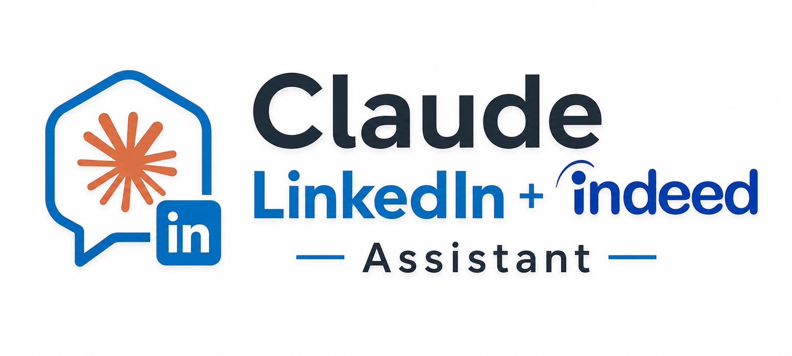

<p align="center">
  
</p>

<p align="center">
  <strong>A Claude Code assistant for LinkedIn.</strong>
</p>

<p align="center">
  <a href="LICENSE"></a>
  
  
</p>

<p align="center">
  <a href="#quick-start"><strong>Quick Start</strong></a> ·
  <a href="#how-it-works"><strong>How it works</strong></a> ·
  <a href="#what-it-does"><strong>What it does</strong></a> ·
  <a href="#daily-flow"><strong>Daily flow</strong></a> ·
  <a href="#privacy"><strong>Privacy</strong></a>
</p>

A Claude Code assistant for LinkedIn. Track jobs in a single CSV, discover new openings via LinkedIn + web search, send connection requests and first DMs at companies you're targeting.

> **Scope on purpose:** Claude only does the safe, repetitive parts. You handle anything that requires judgment (replies, applications, attachments, follow-ups).

## Quick Start

Before anything else, you'll want three things installed:

- **[Claude Code desktop app](https://docs.claude.com/en/docs/claude-code)** — this is the app where you'll actually run everything. It has to be the desktop app, not the web version at claude.ai/code. The web version can't see your local files (resume, tracker CSV, contact log) and can't drive the Chrome extension, so it just won't work for this repo.
- **[Claude in Chrome extension](https://claude.com/claude-in-chrome)** — this is how Claude drives LinkedIn for you. Install it in Chrome, sign in to your LinkedIn account in that same browser, and keep the window open whenever you run a `/jobs` flow. Without this extension, none of the LinkedIn automation works.
- **Git** — already on your Mac. You'll only use it once, in step 1 below.

Once you've got those, here's the flow.

### 1. Clone the repo

Open your terminal and run:

```bash
git clone https://github.com/FarzamHejaziK/claude-linkedin-assistant.git
cd claude-linkedin-assistant
```

That's it for the terminal. Everything else happens inside the Claude Code app.

### 2. Put your resume into `resumes/`

There's no profile file or settings form to fill out. Claude reads your resume directly to figure out your name (so it can verify the right LinkedIn account is signed in), your target roles + top skills (for `/jobs find` searches), and a short pitch (for the outreach DM template).

Just put your resume into the `resumes/` folder however you normally move a file — drag it in from Finder, copy it from wherever you keep your latest version, whatever's easiest. `.pdf`, `.tex`, `.md`, and `.docx` all work. If you have role-specific versions of your resume, drop them all in — the flows read everything in there and use the union of titles + skills.

**Optional, but powerful:** a search profile telling the find flow what you actually *want* (vs. what your resume says you *can* do): must-haves ("Remote only"), deal-breakers ("no crypto"), interest areas ("climate tech"), salary floor ("$200K min"). You can either:

- **Build it together with the agent.** Just tell it your preferences in chat ("I only want remote senior IC roles in climate tech, $180K minimum, no crypto") and it'll write `resumes/search_profile.md` for you.
- **Write it yourself** — see [`resumes/README.md`](resumes/README.md) for the format.

`/jobs find` reads the profile on every run and uses it to filter and score. If you skip it, the search falls back to whatever it can infer from your resume.

### 3. Open the folder in Claude Code

Launch the **Claude Code desktop app**, then **File → Open Folder** and pick the `claude-linkedin-assistant` folder you just cloned. The app loads the workspace and finds all the `/jobs` commands automatically.

### 4. Run `/jobs`

In the chat, type `/jobs` and hit enter. The first thing it does, every time, is verify that the Chrome extension is connected and the LinkedIn account signed in matches the name on your resume. If something's off, it tells you exactly what to fix instead of guessing.

After that, you've got the menu:

```
/jobs                       # show the menu (start here the first time)
/jobs daily                 # walk the full daily flow end-to-end
/jobs find                  # discover new jobs and add them to the tracker
/jobs check                 # daily dashboard: what's pending, what's stale
/jobs outreach <Company>    # connection requests + first DMs at <Company>
/jobs add                   # manually add a job you found somewhere else
```

To change a job's status (Applied, Phone Screen, Onsite, Rejected), edit `job_tracker.csv` directly in Numbers, Excel, or VS Code. There's no separate update command — a one-cell edit is faster than a CLI prompt.

If you just want to see it run, do `/jobs daily` — it walks you through one full day end to end.

For more detail on any of these, see [What it does](#what-it-does), [Daily flow](#daily-flow), or [REQUIREMENTS.md](REQUIREMENTS.md).

## How it works

The whole thing is built around two files that hold all the state. Your resume in `resumes/` is the source of truth about *you* — name, target roles, skills, pitch — i.e. what you *can* do. An optional `resumes/search_profile.md` is the source of truth about what you *want* to do — must-haves, deal-breakers, interest areas, salary floor. And `job_tracker.csv` is the source of truth about the *jobs* — every job you've ever looked at is a row there, with status, priority, dates, deadlines. Claude reads from these and writes back to them. There's no database, no hidden state, no settings panel. Want to see what's going on at any moment? Open the CSV.

When you run any `/jobs` command, the very first thing it does is open Chrome via the extension and check that LinkedIn is signed in to the right account (matching the name it just read from your resume). If something's off — extension not connected, wrong account active, redirected to the login page — it stops and tells you exactly what to fix. This happens every time, on every command, so you never run a flow against the wrong account by accident.

After that, the actual work happens through the Chrome extension. Claude doesn't have a private LinkedIn API; it drives your browser like a person would. Searches use real LinkedIn URLs, profile clicks happen in actual tabs, DMs get typed into the real chat overlay. The upside is LinkedIn sees this as normal browser activity. The tradeoff is you need to keep your signed-in Chrome window open while a flow is running.

The flow that does the most work is `/jobs outreach`. For each company you target, Claude counts how many 1st-degree connections you already have there and computes a per-company quota — more requests if you're sparse, zero if you already have plenty of internal contacts. It then batches the connection requests (always "Send without a note", because LinkedIn rate-limits personalized invites hard) and asks you to confirm the whole batch with one "y". For people you're already connected to, it drafts a short DM using the pitch it pulled from your resume and asks you to approve each one before clicking Send. The loop keeps going across companies until LinkedIn itself pushes back — if you see a CAPTCHA or a "you've reached the weekly limit" notice mid-batch, it halts and reports which contacts went through and which are still pending.

Anything that requires real judgment stays on you: replies once a thread goes warm, follow-up nudges, application forms, attaching a resume to a Gmail thread, deciding what to say when a recruiter asks about your salary expectations. Claude is good at the safe, repetitive parts — sending the same templated first message to twenty new connections, paginating through LinkedIn search results, keeping the CSV in sync, drafting outreach text. It's not good at the high-judgment moments, so by design, it doesn't try to do them.

When you run `/jobs daily`, it strings the four pipeline flows together — find new jobs, check the dashboard, add anything you saw elsewhere, run outreach at HIGH-priority companies that need a referral — with a checkpoint between each step where you can continue, skip, or quit. At the end it makes a single git commit summarizing what happened that day. Run it once and you've done the day's pipeline work in one pass.

## What it does

| Feature | Command | Who does what |
|---|---|---|
| Verify Chrome + LinkedIn login | (auto on every `/jobs` run) | Claude reads your name from your resume in `resumes/` and verifies the active LinkedIn profile matches |
| Find new jobs | `/jobs find` | Claude reads your resume(s), searches LinkedIn + the web, scores and adds results to the tracker |
| Track jobs | `/jobs check` · `/jobs add` | Claude reads/writes `job_tracker.csv`. Status edits are done by hand in the CSV. |
| Outreach (cold sweep) | `/jobs outreach <Company>` | Claude sends connection requests to 2nd-degree contacts ("Send without a note") and a first DM to existing 1st-degree connections at that company |
| Daily run | `/jobs daily` | Walks through find → check → outreach in one pass |

## What it does NOT do (by design)

- ❌ **No reply handling, no follow-ups.** When someone replies to a DM, you handle the conversation.
- ❌ **No application submission, no resume tailoring, no cover letter generation.** Apply yourself.
- ❌ **No file uploads.** LinkedIn / Gmail / ATS forms block automated upload anyway.
- ❌ **No personalized connection-request notes.** All connection requests go through "Send without a note" to conserve LinkedIn's monthly personalized-invite quota.

If you want a more full-featured workflow (resume tailoring, reply handling, application form auto-fill), fork this repo and extend it. This version is intentionally minimal so it's safe to share.

## Daily flow

`/jobs daily` walks through the recommended sequence end to end:

```
1. /jobs check       — dashboard: what's pending, what's stale
2. /jobs find        — discover new jobs via LinkedIn + web search
3. /jobs add         — capture interesting finds (auto-flags companies that need a referral)
4. /jobs outreach    — send first DMs to 1st-degree connections at companies that need outreach
5. commit            — single git commit at the end
```

You can also run sub-commands individually any time.

## Folder layout

```
claude-linkedin-assistant/
├── README.md                     ← this file
├── REQUIREMENTS.md               ← setup steps
├── CLAUDE.md                     ← project rules loaded by Claude
├── LICENSE                       ← MIT
├── .gitignore
├── job_tracker.csv               ← MAIN DASHBOARD. Open in Numbers/Excel/VS Code.
│
├── resumes/                      ← drop your resume(s) here (gitignored by default)
│   └── README.md                 ← committed instructions
│
├── outreach/                     ← created on first /jobs outreach run
│   └── <Company>_contacts.md     ← per-company contact log (gitignored by default)
│
└── .claude/
    └── commands/
        ├── jobs.md               ← top-level /jobs command
        └── jobs/
            ├── _shared.md        ← rules loaded by every sub-flow
            ├── find.md           ← discover jobs
            ├── check.md          ← daily dashboard
            ├── add.md            ← add a job to the tracker
            ├── outreach.md       ← first-message DM flow
            └── daily.md          ← orchestrator
```

## Tracker format

`job_tracker.csv` columns:

```
Priority, Company, Role, Location, Type, Salary, Status, Applied Date,
Next Action, URL, Notes, Discovered Date, Referral Needed, Referral Status,
Referral Deadline, Apply Via
```

Canonical statuses: `To Apply` → `Applied` → `Recruiter Call` → `Phone Screen` → `Onsite` → `Offer` / `Rejected` / `Withdrew`

Open in any spreadsheet app or use the `/jobs check` dashboard.

## Privacy

- `resumes/*` (everything except `resumes/README.md`) is `.gitignore`d by default. Your resume stays local.
- `outreach/*.md` is `.gitignore`d. Your contact log stays local.

If you fork to a private repo and want to commit your resume too, edit `.gitignore`.

## Contributing

Pull requests only. Direct pushes to `main` are blocked.

- See [`CONTRIBUTING.md`](CONTRIBUTING.md) for the workflow.
- See [`MAINTAINERS.md`](MAINTAINERS.md) for the approval model (single-maintainer, [@FarzamHejaziK](https://github.com/FarzamHejaziK) approves all PRs).
- For security reports, see [`SECURITY.md`](SECURITY.md) and email instead of opening a public Issue.

## License

MIT. See [LICENSE](LICENSE).
